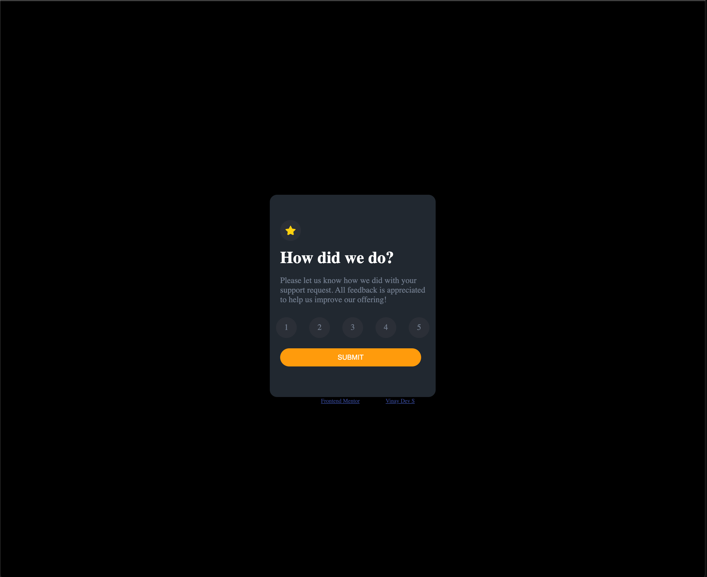
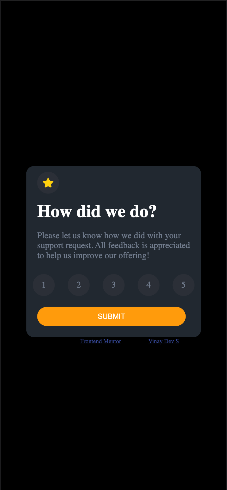
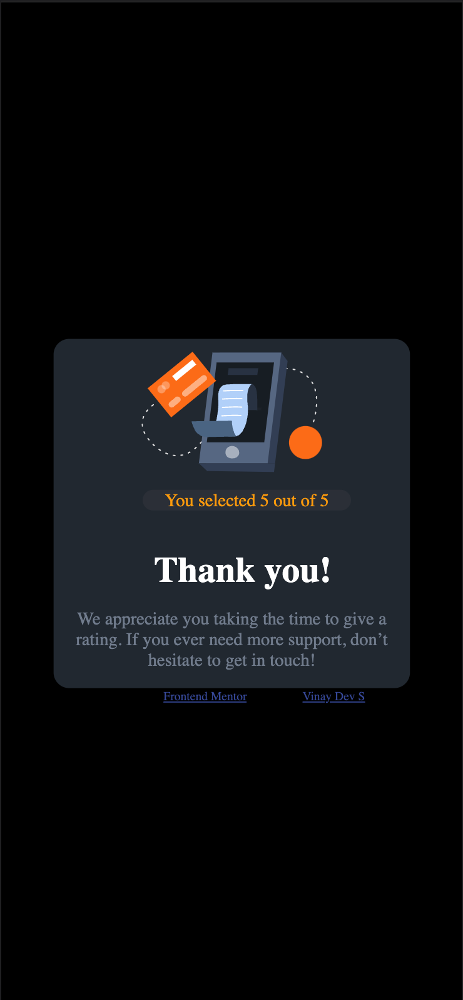
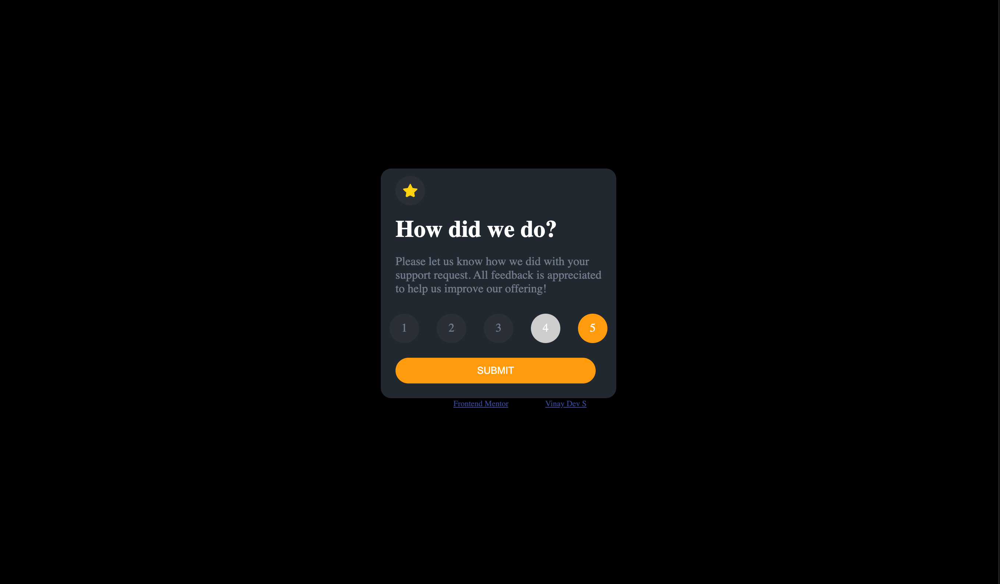

# Frontend Mentor - Interactive rating component solution

This is a solution to the [Interactive rating component challenge on Frontend Mentor](https://www.frontendmentor.io/challenges/interactive-rating-component-koxpeBUmI). Frontend Mentor challenges help you improve your coding skills by building realistic projects. 

## Table of contents

- [Overview](#overview)
  - [The challenge](#the-challenge)
  - [Screenshot](#screenshot)
  - [Links](#links)
- [My process](#my-process)
  - [Built with](#built-with)
- [Author](#author)

## Overview
An interactive rating component is a user interface element that allows users to rate items or services on a scale, such as 1 to 5 stars.
The use of interactive rating components can enhance user engagement and provide valuable feedback for the item or service being rated.
### The challenge

Users should be able to:

- View the optimal layout for the app depending on their device's screen size
- See hover states for all interactive elements on the page
- Select and submit a number rating
- See the "Thank you" card state after submitting a rating

### Screenshot

### Links

- Solution URL: [Solution](https://www.frontendmentor.io/challenges/interactive-rating-component-koxpeBUmI/hub)
- Live Site URL: [liveSite](https://interactiverating2.netlify.app/)

## My process

### Built with

- Semantic HTML5 markup
- CSS custom properties
- Flexbox
- Javascript

## Author

- LinkedIn - [Vinay Dev S](https://www.linkedin.com/in/vinay-dev-s/)
- Frontend Mentor - [@vinaydevs](https://www.frontendmentor.io/profile/vinay-devs)
- Twitter - [@vinaydevs](https://twitter.com/vinaydevs)

